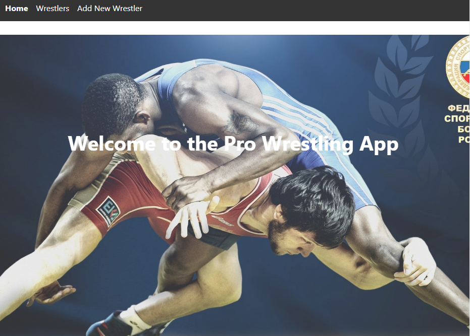
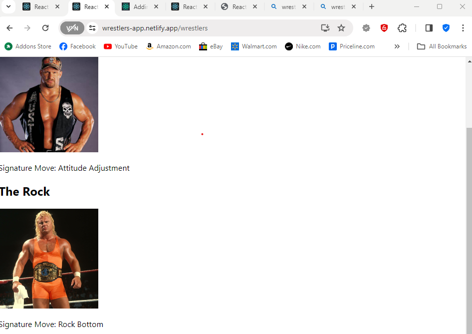

## Pro Wrestling App

## Overview
The Pro Wrestling App is a single-page application built with React that allows users to view a list of wrestlers, add new wrestlers, and see detailed information about each wrestler. The app is designed to demonstrate core React concepts such as components, props, state management, and client-side routing.

## Features
View a list of wrestlers
Add a new wrestler to the list
View detailed information about each wrestler
Client-side routing using React Router
RESTful API integration using json-server

## Project Structure
The application consists of the following components:

App.js - The main component that sets up routing and renders the NavBar.
NavBar.js - A navigation bar that allows users to navigate between different routes.
Home.js - The home page of the application.
WrestlerList.js - Displays a list of wrestlers.
WrestlerCard.js - Displays individual wrestler information.
NewWrestlerForm.js - A form to add a new wrestler.


## Routes
The application has the following routes:

/ - Home page
/wrestlers - Page displaying the list of wrestlers
/wrestlers/new - Page with a form to add a new wrestler

## Installation
Clone the repository:

sh
Copy code
git clone <repository-url>
Navigate to the project directory:

sh
Copy code
cd <project-directory>
Install dependencies:

sh
Copy code
npm install
Start the JSON server:

sh
Copy code
json-server --watch db.json --port 3001
Start the React application:

sh
Copy code
npm start


## Usage
Home Page: Displays a welcome message.
Wrestler List: View all wrestlers in the database.
Add Wrestler: Use the form to add a new wrestler.
API Endpoints
The application uses a json-server to simulate a RESTful API. The following endpoints are available:

GET /wrestlers - Retrieves a list of wrestlers.
POST /wrestlers - Adds a new wrestler.
Code Snippets
Adding a New Wrestler
NewWrestlerForm.js:

```jsx

import React, { useState } from 'react';

function NewWrestlerForm() {
  const [name, setName] = useState('');
  const [bio, setBio] = useState('');

  function handleSubmit(event) {
    event.preventDefault();
    const newWrestler = { name, bio };
    fetch('http://localhost:3001/wrestlers', {
      method: 'POST',
      headers: { 'Content-Type': 'application/json' },
      body: JSON.stringify(newWrestler),
    })
      .then(response => response.json())
      .then(data => {
        // handle the new wrestler addition logic here
      });
  }

  return (
    <form onSubmit={handleSubmit}>
      <label>
        Name:
        <input type="text" value={name} onChange={e => setName(e.target.value)} />
      </label>
      <label>
        Bio:
        <input type="text" value={bio} onChange={e => setBio(e.target.value)} />
      </label>
      <button type="submit">Add Wrestler</button>
    </form>
  );
}

export default NewWrestlerForm;
```
## Screenshots

Caption: Screenshot of the home page.



Caption: Screenshot of the wrestler list.


## Deployment
The application is deployed on Netlify. You can access it here.
 https://wrestlers-app.netlify.app/
##  Video Walkthrough
Watch a video walkthrough of the app here.

## Blog Post
Read more about the technical aspects of this project in my blog post here.

Acknowledgements
Flatiron School
React
json-server
Netlify
License
This project is licensed under the MIT License - see the LICENSE file for details.